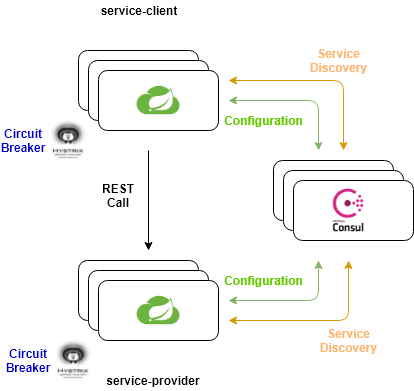
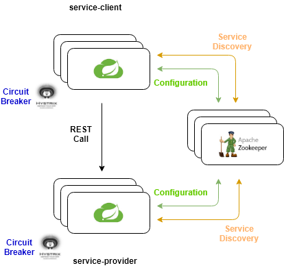

# spring-cloud-labs

This Lab lab is focused on Microservices Architecture implementation based on **Spring Cloud**

Main topics are

 - **Service Registry & Discovery**
 - **Distributed Configuration**
 - **Circuit Breaker**

Spring Cloud is based on Spring Boot and act as an abstraction layer over the previous (and many other) topics since is able to demand concrete implementations to several providers using Dependency Injection and configuration.

Implementations are interchangeable and can be enabled / disabled based on their presence on application's classpath.

Different implementations may differ on configuration parameters.

The lab shows the interaction between 2 microservices using HTTP Rest, how it's possible to manage situations where services can scale up / scale down / crash / restart dynamically having different IP addresses and how an application can react to failures of services it depends on using circuit breakers to avoid cascading of these failures. This kind of scenario is exactly what happens in a Cloud environment: services goes up and down due to failures, autoscaling rules and IP addresses are dynamic.

## Environment Setup
Please install the following prerequisites
* Java JDK 8
* Maven 3.3+
* Git
* Docker
* Kubernetes


## service-provider
A sample REST service that exposes 2 endpoints

GET http://[ip_address]:[port]/prop1

GET http://[ip_address]:[port]/prop2

## service-client
Another REST service that calls service-provider and exposes 2 endpoints

GET http://[ip_address]:[port]/remote-prop1

This endpoint calls /prop1 endpoint exposed by service-provider

GET http://[ip_address]:[port]/remote-prop2

This endpoint calls /prop2 endpoint exposed by service-provider

service client depends on service-provider


## Service Discovery & Distributed Configuration with Hashicorp Consul
Consul from Hashicorp provide both Service Discovery and Distributed Configuration

Spring Cloud microservices can interact with Service Discovery providers using the annotation @EnableDiscoveryClient as shown in the following snippet:

```java
package mdaros.labs.spring.cloud.service.provider;

import org.springframework.boot.SpringApplication;
import org.springframework.boot.autoconfigure.SpringBootApplication;
import org.springframework.cloud.client.discovery.EnableDiscoveryClient;

@SpringBootApplication
@EnableDiscoveryClient
public class ServiceProviderApplication {

	public static void main ( String [] args ) {

		SpringApplication.run ( ServiceProviderApplication.class, args );
	}
}
```
Service Discovery keep track of Discovery Clients when they start and monitor their health maintaining a dynamic view of healthy services



## Service Discovery & Distributed Configuration with Apache Zookeeper



